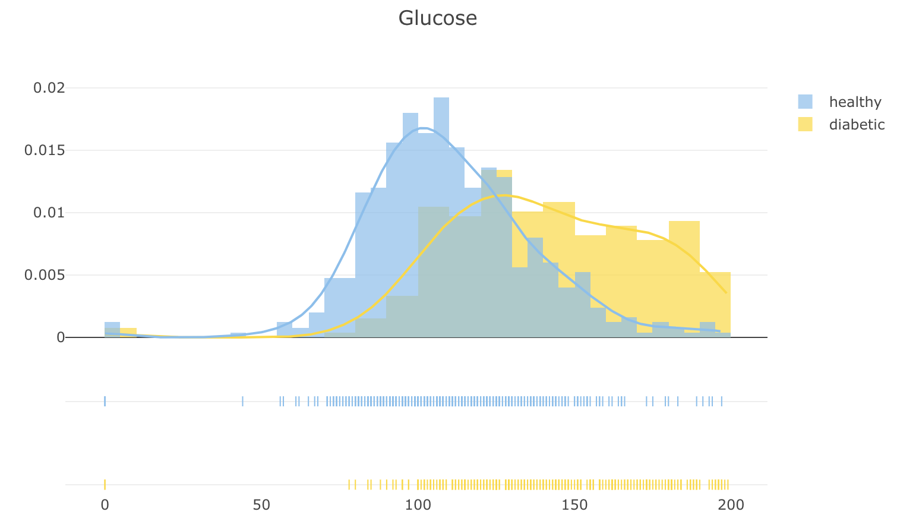
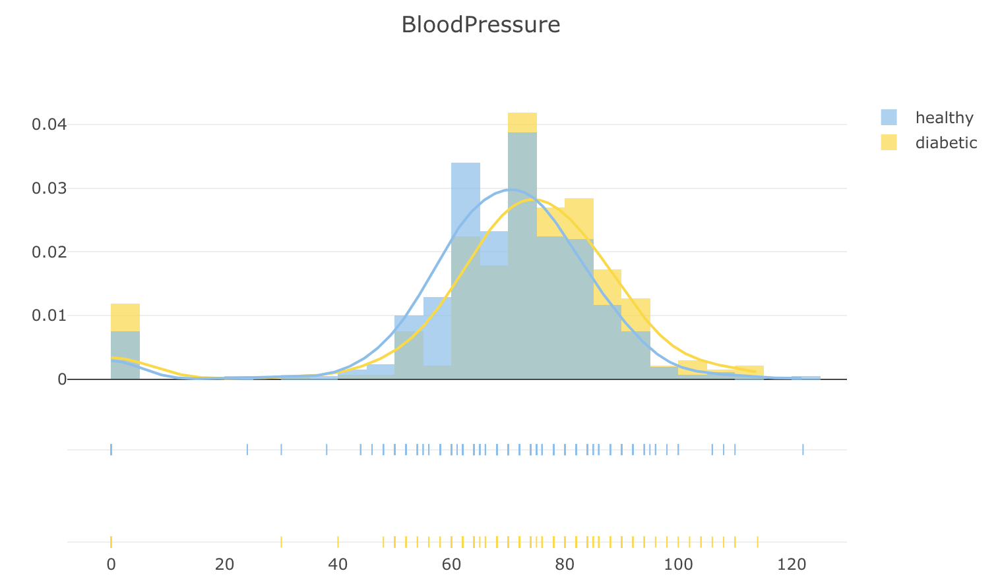
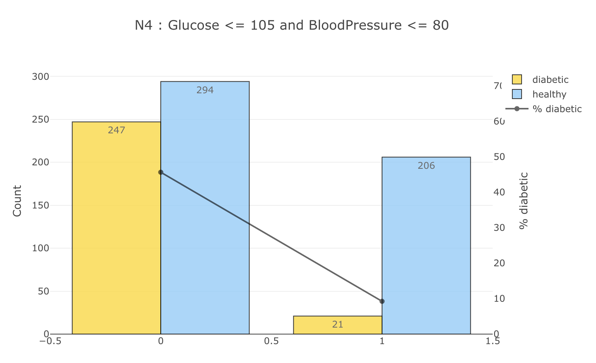
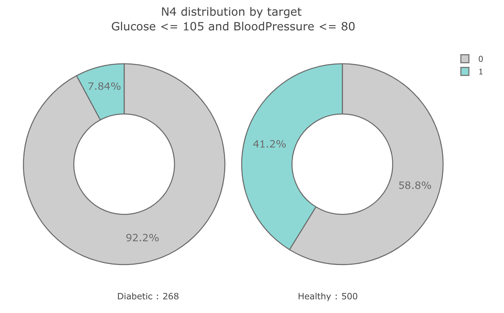

# Feature-Engineering-Deep-Dive-Pima-Indians-Pima-Indians

# Executive Summary

Feature engineering is a critical process in data science, transforming raw data into meaningful features that enhance the performance of machine learning models. This report explores the fundamentals and advanced techniques of feature engineering, emphasizing its significance in cybersecurity applications. By creating, encoding, scaling, and selecting features, data scientists can extract valuable insights and improve model accuracy. The report provides a comprehensive guide to understanding the types of features, data preprocessing, and various techniques to optimize the feature engineering process, ultimately driving better decision-making in cybersecurity.

## Table of Contents

1. [Introduction](#1-introduction)
    - [1.1 Overview of Feature Engineering](#11-overview-of-feature-engineering)
    - [1.2 Importance in Data Science](#12-importance-in-data-science)
2. [Fundamentals of Feature Engineering](#2-fundamentals-of-feature-engineering)
    - [2.1 Definition and Objectives](#21-definition-and-objectives)
    - [2.2 Types of Features](#22-types-of-features)
        - [2.2.1 Numerical Features](#221-numerical-features)
        - [2.2.2 Categorical Features](#222-categorical-features)
        - [2.2.3 Temporal Features](#223-temporal-features)
        - [2.2.4 Text Features](#224-text-features)
        - [2.2.5 Image Features](#225-image-features)
    - [2.3 Data Preprocessing](#23-data-preprocessing)
        - [2.3.1 Data Cleaning](#231-data-cleaning)
        - [2.3.2 Handling Missing Values](#232-handling-missing-values)
        - [2.3.3 Data Transformation](#233-data-transformation)
3. [Advanced Feature Engineering Techniques](#3-advanced-feature-engineering-techniques)
    - [3.1 Feature Creation](#31-feature-creation)
        - [3.1.1 Polynomial Features](#311-polynomial-features)
        - [3.1.2 Interaction Features](#312-interaction-features)
        - [3.1.3 Aggregation Features](#313-aggregation-features)
        - [3.1.4 Domain-Specific Features](#314-domain-specific-features)
        - [3.1.5 Text Feature Creation](#315-text-feature-creation)
        - [3.1.6 Image Feature Creation](#316-image-feature-creation)
        - [3.1.7 Temporal Feature Creation](#317-temporal-feature-creation)
        - [3.1.8 Frequency Feature Creation](#318-frequency-feature-creation)
        - [3.1.9 Binary Feature Creation](#319-binary-feature-creation)
    - [3.2 Encoding Techniques](#32-encoding-techniques)
        - [3.2.1 One-Hot Encoding](#321-one-hot-encoding)
        - [3.2.2 Label Encoding](#322-label-encoding)
        - [3.2.3 Frequency Encoding](#323-frequency-encoding)
        - [3.2.4 Target Encoding](#324-target-encoding)
        - [3.2.5 Temporal Encoding](#325-temporal-encoding)
    - [3.3 Feature Scaling](#33-feature-scaling)
        - [3.3.1 Normalization](#331-normalization)
        - [3.3.2 Standardization](#332-standardization)
        - [3.3.3 Robust Scaler](#333-robust-scaler)
    - [3.4 Dimensionality Reduction](#34-dimensionality-reduction)
        - [3.4.1 Principal Component Analysis (PCA)](#341-principal-component-analysis-pca)
        - [3.4.2 Linear Discriminant Analysis (LDA)](#342-linear-discriminant-analysis-lda)
        - [3.4.3 t-Distributed Stochastic Neighbor Embedding (t-SNE)](#343-t-distributed-stochastic-neighbor-embedding-t-sne)
    - [3.5 Feature Extraction](#35-feature-extraction)
        - [3.5.1 Text Feature Extraction](#351-text-feature-extraction)
            - [3.5.1.1 TF-IDF](#3511-tf-idf)
            - [3.5.1.2 Word Embeddings](#3512-word-embeddings)
        - [3.5.2 Image Feature Extraction](#352-image-feature-extraction)
            - [3.5.2.1 Convolutional Neural Networks (CNNs)](#3521-convolutional-neural-networks-cnns)
            - [3.5.2.2 Pre-trained Models](#3522-pre-trained-models)
    - [3.6 Feature Selection](#36-feature-selection)
        - [3.6.1 Filter Methods](#361-filter-methods)
        - [3.6.2 Wrapper Methods](#362-wrapper-methods)
        - [3.6.3 Embedded Methods](#363-embedded-methods)
        - [3.6.4 Regularization Techniques](#364-regularization-techniques)
4. [Conclusion](#4-conclusion)
5. [References](#5-references)

# 1. Introduction

In the rapidly evolving field of data science, the ability to transform raw data into meaningful insights is paramount. Feature engineering is the process of using domain knowledge to extract features from raw data that make machine learning algorithms work more effectively. This process is especially crucial in cybersecurity, where the accurate detection and prediction of threats depend on the quality of the input features.

## 1.1 Overview of Feature Engineering

Feature engineering involves creating new features or modifying existing ones to improve the performance of machine learning models. This process can include generating new variables, transforming existing data, and encoding categorical variables. Effective feature engineering requires a deep understanding of the data and the underlying domain, allowing data scientists to highlight relevant patterns and discard irrelevant information. 

## 1.2 Importance in Data Science

Feature engineering is vital in data science for several reasons. Firstly, it directly impacts the model's ability to learn and generalize from the data, thus influencing the overall performance of the predictive models. Secondly, it helps in reducing the complexity of models by enabling simpler algorithms to achieve competitive performance. Lastly, in the context of cybersecurity, well-engineered features can significantly enhance the detection of malicious activities, improve response times, and reduce false positives, thereby strengthening the overall security posture of an organization.

## 2. Fundamentals of Feature Engineering

### 2.1 Definition and Objectives

Feature engineering is the process of transforming raw data into meaningful features that enhance the performance of machine learning models. It involves creating new variables, transforming existing data, and encoding categorical variables to highlight relevant patterns and discard irrelevant information. The primary objectives of feature engineering are to improve model accuracy, reduce complexity, and ensure that the data is in a suitable format for analysis.

The essence of feature engineering lies in its ability to leverage domain knowledge to create features that capture the underlying patterns in the data. This process is iterative and requires a deep understanding of both the data and the problem domain. In the context of cybersecurity, effective feature engineering can significantly enhance the detection and prediction of threats, improve response times, and reduce false positives.

### 2.2 Types of Features

Features can be broadly categorized into several types, each with its unique characteristics and methods of creation. Understanding these types is crucial for effective feature engineering.

#### 2.2.1 Numerical Features

Numerical features are quantitative data points that can be measured and ordered. These features include continuous variables like age, income, or temperature, and discrete variables like the number of occurrences or counts. Numerical features are often used in statistical analysis and machine learning models to capture patterns and relationships within the data.

#### 2.2.2 Categorical Features

Categorical features represent qualitative data that can be divided into different categories or groups. Examples include gender, product type, or region. Categorical features are typically encoded into numerical values to be used in machine learning models. Common encoding techniques include one-hot encoding, label encoding, and frequency encoding.

#### 2.2.3 Temporal Features

Temporal features are derived from time-based data, such as timestamps or dates. These features can include information like the day of the week, month, year, or time of day. Temporal features are crucial in identifying trends, seasonality, and patterns over time, which are often important in time series analysis and forecasting.

#### 2.2.4 Text Features

Text features are extracted from textual data, such as documents, emails, or social media posts. These features can be created using techniques like bag-of-words, term frequency-inverse document frequency (TF-IDF), or word embeddings. Text features are essential for natural language processing (NLP) tasks and can provide valuable insights into the context and sentiment of the text.

#### 2.2.5 Image Features

Image features are derived from image data and can include characteristics like edges, textures, colors, and shapes. Techniques such as convolutional neural networks (CNNs) are commonly used to extract features from images. Image features are crucial in tasks like image classification, object detection, and computer vision.

### 2.3 Data Preprocessing

Data preprocessing is a critical step in the feature engineering process, ensuring that the data is clean, consistent, and ready for analysis. This step involves several techniques, including data cleaning, handling missing values, and data transformation.

#### 2.3.1 Data Cleaning

Data cleaning involves identifying and correcting errors or inconsistencies in the dataset. This can include removing duplicate records, correcting typos, and standardizing formats. Data cleaning is essential to ensure the accuracy and reliability of the data, as errors can significantly impact the performance of machine learning models.

#### 2.3.2 Handling Missing Values

Handling missing values is a crucial aspect of data preprocessing. Missing data can occur due to various reasons, such as data entry errors or incomplete records. There are several strategies to handle missing values, including:

- **Removal**: Deleting records with missing values if the proportion is small and won't significantly impact the analysis.
- **Imputation**: Replacing missing values with statistical estimates like mean, median, or mode.
- **Prediction**: Using machine learning models to predict and fill in missing values based on other features.

Choosing the appropriate strategy depends on the nature of the data and the problem at hand.

#### 2.3.3 Data Transformation

Data transformation involves converting data into a suitable format for analysis. This can include scaling numerical features, encoding categorical variables, and normalizing data. Common data transformation techniques include:

- **Scaling**: Adjusting the range of numerical features to ensure they are on a similar scale. Techniques include standardization (mean = 0, standard deviation = 1) and normalization (scaling to a range of 0 to 1).
- **Encoding**: Converting categorical features into numerical values using techniques like one-hot encoding, label encoding, and frequency encoding.
- **Normalization**: Adjusting the data distribution to improve model performance, especially for algorithms sensitive to data scale.

Effective data transformation ensures that the features are in an optimal format for machine learning models, enhancing their performance and accuracy.

## 4. Advanced Feature Engineering Techniques

### 4.1 Feature Creation

Feature creation involves generating new features from existing data to enhance model performance. These new features can capture additional information and relationships within the data.

#### 4.1.1 Polynomial Features
Polynomial features involve creating new features by raising existing numerical features to a power or by multiplying them together. This can capture non-linear relationships in the data.

#### 4.1.2 Interaction Features
Interaction features are created by combining two or more features to capture the interaction effect between them. For example, multiplying two features together can provide new insights into their combined effect on the target variable.

#### 4.1.3 Aggregation Features
Aggregation features are derived by summarizing multiple rows of data into a single feature. Common aggregation methods include sum, mean, median, and count. These features are useful in time series and grouped data analysis.

#### 4.1.4 Domain-Specific Features
Domain-specific features are created based on domain knowledge and expertise. These features are tailored to the specific problem and data set, leveraging insights from the field to improve model performance.

#### 4.1.5 Text Feature Creation
Text feature creation involves extracting meaningful features from textual data. Techniques such as n-grams, bag-of-words, and sentiment analysis are commonly used to transform text into numerical features.

#### 4.1.6 Image Feature Creation
Image feature creation involves extracting relevant information from image data. Techniques like edge detection, texture analysis, and object recognition are used to create features that capture the essential characteristics of images.

#### 4.1.7 Temporal Feature Creation
Temporal feature creation involves generating features based on time-related data, such as timestamps or dates. Examples include extracting the day of the week, month, year, hour, and time intervals between events.

#### 4.1.8 Frequency Feature Creation
Frequency features are created by counting the occurrences of specific values or categories in the data. These features can capture patterns in categorical data, such as the frequency of certain events or the distribution of categories.

#### 4.1.9 Binary Feature Creation
Binary feature creation involves generating features with binary values (0 or 1) to indicate the presence or absence of a specific condition or category. This is useful for capturing categorical information in a binary format.

### 4.2 Encoding Techniques

Encoding techniques transform categorical features into numerical values that can be used in machine learning models. Proper encoding ensures that the categorical data is represented in a meaningful way.

#### 4.2.1 One-Hot Encoding
One-hot encoding transforms categorical variables into a set of binary features, each representing a unique category. This technique is useful for nominal categories without an inherent order.

#### 4.2.2 Label Encoding
Label encoding assigns a unique numerical value to each category in a categorical feature. This method is suitable for ordinal categories with an inherent order.

#### 4.2.3 Frequency Encoding
Frequency encoding replaces each category with the frequency of its occurrence in the dataset. This technique captures the importance of each category based on its prevalence.

#### 4.2.4 Target Encoding
Target encoding replaces each category with a summary statistic of the target variable for that category, such as the mean or median. This technique can capture relationships between categorical features and the target variable.

#### 4.2.5 Temporal Encoding
Temporal encoding transforms time-related data into features that capture temporal patterns. Examples include encoding dates as the number of days since a reference date or extracting cyclical patterns from time data.

### 4.3 Feature Scaling

Feature scaling adjusts the range and distribution of numerical features to improve model performance and convergence speed.

#### 4.3.1 Normalization
Normalization scales numerical features to a range of [0, 1] or [-1, 1]. This technique ensures that all features contribute equally to the model.

#### 4.3.2 Standardization
Standardization scales numerical features to have a mean of 0 and a standard deviation of 1. This technique is useful for features with different units or magnitudes.

#### 4.3.3 Robust Scaler
The robust scaler uses the median and interquartile range to scale features, making it robust to outliers. This technique is useful when the data contains significant outliers.

### 4.4 Dimensionality Reduction

Dimensionality reduction techniques reduce the number of features while retaining as much information as possible, improving model performance and reducing overfitting.

#### 4.4.1 Principal Component Analysis (PCA)
PCA transforms features into a set of orthogonal components that capture the maximum variance in the data. It reduces dimensionality by selecting a subset of these components.

#### 4.4.2 Linear Discriminant Analysis (LDA)
LDA is a supervised dimensionality reduction technique that maximizes the separation between classes. It projects features into a lower-dimensional space that enhances class separability.

#### 4.4.3 t-Distributed Stochastic Neighbor Embedding (t-SNE)
t-SNE is a non-linear dimensionality reduction technique that visualizes high-dimensional data in a lower-dimensional space. It preserves local structures and is useful for exploratory data analysis.

### 4.5 Feature Extraction

Feature extraction involves deriving new features from raw data, especially for text and image data, using specialized techniques.

#### 4.5.1 Text Feature Extraction

##### 4.5.1.1 TF-IDF
TF-IDF (Term Frequency-Inverse Document Frequency) measures the importance of a word in a document relative to a collection of documents. It is a common technique for text feature extraction in NLP.

##### 4.5.1.2 Word Embeddings
Word embeddings, such as Word2Vec and GloVe, transform words into dense vectors that capture semantic relationships. These embeddings are useful for representing text data in machine learning models.

#### 4.5.2 Image Feature Extraction

##### 4.5.2.1 Convolutional Neural Networks (CNNs)
CNNs automatically extract hierarchical features from images, capturing spatial relationships and patterns. They are widely used in image classification and object detection tasks.

##### 4.5.2.2 Pre-trained Models
Pre-trained models, such as VGG, ResNet, and Inception, are trained on large image datasets and can be used to extract features from new images. These models provide high-quality features for various image analysis tasks.

### 4.6 Feature Selection

Feature selection techniques identify the most relevant features for a model, improving performance and reducing overfitting.

#### 4.6.1 Filter Methods
Filter methods select features based on statistical properties, such as correlation or mutual information. These methods are fast and independent of the learning algorithm.

#### 4.6.2 Wrapper Methods
Wrapper methods evaluate feature subsets based on model performance. Techniques like recursive feature elimination (RFE) iteratively remove the least important features to find the best subset.

#### 4.6.3 Embedded Methods
Embedded methods perform feature selection during the model training process. Techniques like LASSO and Ridge regression include regularization terms that penalize less important features.

#### 4.6.4 Regularization Techniques
Regularization techniques, such as L1 and L2 regularization, add penalty terms to the loss function to reduce overfitting. These techniques shrink the coefficients of less important features, effectively performing feature selection.

**Why This Project Matters:**

Feature engineering is critical to improving model accuracy and performance. This project showcases my ability to manipulate and transform data to extract valuable features, enhancing the predictive power of models. In the realm of cybersecurity, effective feature engineering can significantly enhance threat detection, behavioral analysis, malware classification, and risk assessment. This demonstrates my capability to apply advanced feature engineering techniques to improve security measures, protect sensitive information, and ensure robust cybersecurity defenses.

**Project Highlights:**
- **In-Depth Analysis:** Provides a comprehensive exploration of feature engineering techniques and their impact on model performance. In cybersecurity, this involves transforming raw data into meaningful features that enhance threat detection and behavioral analysis.
- **Practical Applications:** Demonstrates the practical value of feature engineering in achieving superior results. Applications include improving malware classification, phishing detection, intrusion detection systems (IDS), and anomaly detection in cloud security.

*Figure 1: Glucose Distribution - The blue curve with a medium of 107.0 mmol/L represents healthy patients while the yellow curve with a medium of 140.0 mmol/L represnets diabetic patients.*

*Figure 2: Blood Pressure Distribution - The blue curve with a medium of 70.0 mm Hg represents healthy patients while the yellow curve with a medium of 74.5 mm Hg represnets diabetic patients.*

*Figure 1: Surveillance privacy bias vector - This image illustrates the surveillance privacy bias vector and how serveillance related terms in blue tend to be above the line and privacy related terms in orange tend to be below the line.*

*Figure 1: Surveillance privacy bias vector - This image illustrates the surveillance privacy bias vector and how serveillance related terms in blue tend to be above the line and privacy related terms in orange tend to be below the line.*

*Figure 1: Surveillance privacy bias vector - This image illustrates the surveillance privacy bias vector and how serveillance related terms in blue tend to be above the line and privacy related terms in orange tend to be below the line.*

*Figure 1: Surveillance privacy bias vector - This image illustrates the surveillance privacy bias vector and how serveillance related terms in blue tend to be above the line and privacy related terms in orange tend to be below the line.*
