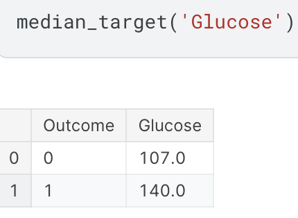
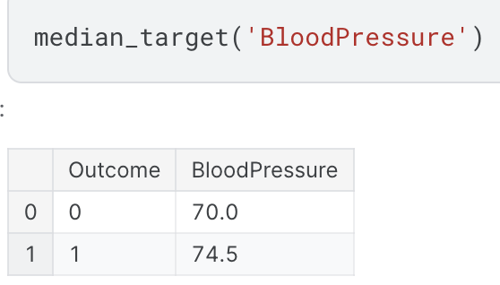

# Feature-Engineering-Deep-Dive-Pima-Indians-Pima-Indians

**Why This Project Matters:**

Feature engineering is critical to improving model accuracy and performance. This project showcases my ability to manipulate and transform data to extract valuable features, enhancing the predictive power of models. In the realm of cybersecurity, effective feature engineering can significantly enhance threat detection, behavioral analysis, malware classification, and risk assessment. This demonstrates my capability to apply advanced feature engineering techniques to improve security measures, protect sensitive information, and ensure robust cybersecurity defenses.

**Project Highlights:**
- **In-Depth Analysis:** Provides a comprehensive exploration of feature engineering techniques and their impact on model performance. In cybersecurity, this involves transforming raw data into meaningful features that enhance threat detection and behavioral analysis.
- **Practical Applications:** Demonstrates the practical value of feature engineering in achieving superior results. Applications include improving malware classification, phishing detection, intrusion detection systems (IDS), and anomaly detection in cloud security.

*Figure 1: Glucose Distribution - This image illustrates the surveillance privacy bias vector and how serveillance related terms in blue tend to be above the line and privacy related terms in orange tend to be below the line.*

*Figure 1: Surveillance privacy bias vector - This image illustrates the surveillance privacy bias vector and how serveillance related terms in blue tend to be above the line and privacy related terms in orange tend to be below the line.*

  
  

*Figure 1: Surveillance privacy bias vector - This image illustrates the surveillance privacy bias vector and how serveillance related terms in blue tend to be above the line and privacy related terms in orange tend to be below the line.*

*Figure 1: Surveillance privacy bias vector - This image illustrates the surveillance privacy bias vector and how serveillance related terms in blue tend to be above the line and privacy related terms in orange tend to be below the line.*

*Figure 1: Surveillance privacy bias vector - This image illustrates the surveillance privacy bias vector and how serveillance related terms in blue tend to be above the line and privacy related terms in orange tend to be below the line.*
